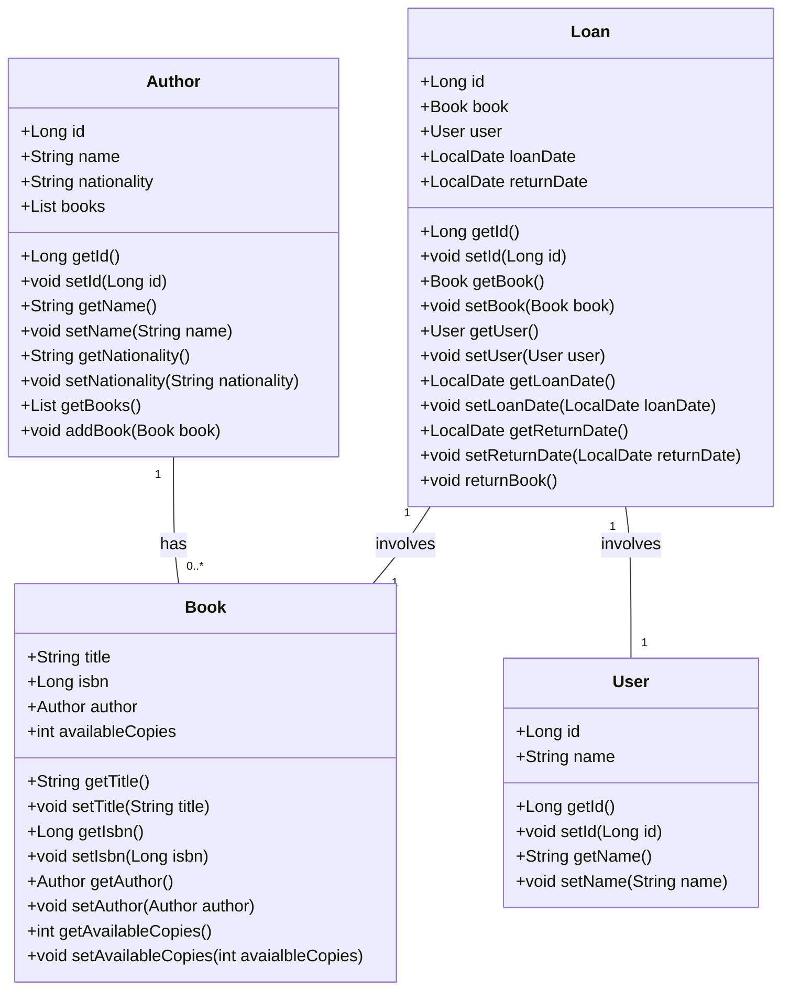

# Library Manager API 
JAVA RESTful API designed for a Library.

## Class Diagram

```mermaid
classDiagram
    class Book {
        +String title
        +Long isbn
        +Author author
        +int availableCopies
        +String getTitle()
        +void setTitle(String title)
        +Long getIsbn()
        +void setIsbn(Long isbn)
        +Author getAuthor()
        +void setAuthor(Author author)
        +int getAvailableCopies()
        +void setAvailableCopies(int avaialbleCopies)
    }

    class Author {
        +Long id    
        +String name
        +String nationality
        +List<Book> books
        +Long getId()
        +void setId(Long id)
        +String getName()
        +void setName(String name)
        +String getNationality()
        +void setNationality(String nationality)
        +List<Book> getBooks()
        +void addBook(Book book)
    }

    class User {
        +Long id
        +String name
        +Long getId()
        +void setId(Long id)
        +String getName()
        +void setName(String name)
    }

    class Loan {
        +Long id
        +Book book
        +User user
        +LocalDate loanDate
        +LocalDate returnDate
        +Long getId()
        +void setId(Long id)
        +Book getBook()
        +void setBook(Book book)
        +User getUser()
        +void setUser(User user)
        +LocalDate getLoanDate()
        +void setLoanDate(LocalDate loanDate)
        +LocalDate getReturnDate()
        +void setReturnDate(LocalDate returnDate)
        +void returnBook()
    }

    Author "1" -- "0..*" Book : has
    Loan "1" -- "1" Book : involves
    Loan "1" -- "1" User : involves
```
